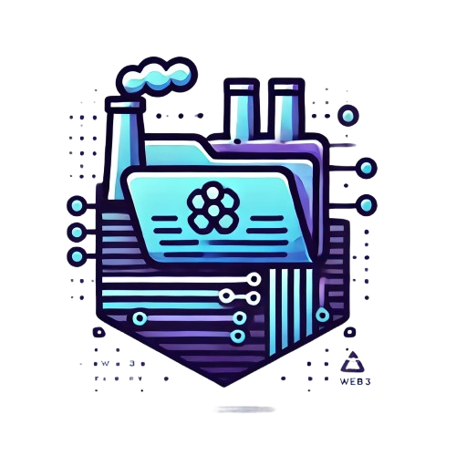

<a name="readme-top"></a>

[![Contributors][contributors-shield]][contributors-url]
[![Forks][forks-shield]][forks-url]
[![Stargazers][stars-shield]][stars-url]
[![Issues][issues-shield]][issues-url]
[![MIT License][license-shield]][license-url]

<!-- PROJECT LOGO -->
<br />
<div align="center">
  <a href="https://github.com/KPR-V/StorageFactory">
    
  </a>

<h1 align="center"> Storage Factory</h1>

<h3 align="center">📁 Decentralized File Storage Management System</h3>

  <p align="center">
    Storage Factory is a decentralized file storage management system that allows users to organize and manage their files using smart contracts on the blockchain. Built with Solidity and Next.js, it provides a secure and user-friendly interface for file management.
  </p>
  
  <p align="center">
    <a href="https://github.com/KPR-V/StorageFactory/issues/new?labels=bug">🐛 Report Bug</a>
    ·
    <a href="https://github.com/KPR-V/StorageFactory/issues/new?labels=enhancement">✨ Request Feature</a>
  </p>
</div>

---

## 🔥 Key Features

- **📂 Smart Contract Storage**: Secure file management using Solidity smart contracts on the blockchain.

- **🗂️ Folder Organization**: Create and manage folders to organize your files efficiently.

- **🔄 Version Control**: Maintain multiple versions of files within folders.

- **🗑️ File Management**: Upload, delete, and manage files with ease through a modern UI.

- **⚡ Real-time Updates**: Instant reflection of changes in the UI using Next.js and blockchain events.

---

## 🚀 Get Started

1. **Clone the repo**:
    ```sh
    git clone https://github.com/KPR-V/StorageFactory.git
    cd StorageFactory
    ```

2. **Install Dependencies and Run**:

    - **Smart Contracts (Foundry) ⚒️**
      ```sh
      cd contracts
      forge install
      forge test
      forge build
      ```

    - **Frontend (Next.js) 🎨**
      ```sh
      cd ui
      pnpm install
      pnpm run dev
      ```

3. **Configure Environment**:
    - Create `.env` file in the ui directory with the following variables:
      ```plaintext
      # Pinata Configuration
      NEXT_PUBLIC_PINATA_API_KEY=your_pinata_api_key
      PINATA_SECRET_API_KEY=your_pinata_secret_key
      PINATA_JWT=your_pinata_jwt_token

      # Blockchain Configuration
      NEXT_PUBLIC_CONTRACT_ADDRESS=your_deployed_contract_address
      NEXT_PUBLIC_WALLET_CONNECT_PROJECT_ID=your_wallet_connect_project_id

      # Gateway Configuration
      NEXT_PUBLIC_GATEWAY_URL=your_gateway_url
      ```


---

## 🏗️ Project Structure

- **/contracts**: Solidity smart contracts
  - Storage.sol: Main contract for file management
  - Comprehensive test suite

- **/ui**: Next.js frontend application
  - Modern UI components using shadcn/ui
  - Full TypeScript support
  - Responsive design

---

## 📜 License

Distributed under the MIT License. See `LICENSE.txt` for more details.

---

## 📞 Contact

📧 **Varun Kapoor** <br />
🐦 Twitter: [@Vkiitr](https://twitter.com/Vkiitr) <br />
📬 Email: kapoorv046@gmail.com

---

<!-- MARKDOWN LINKS & IMAGES -->
[contributors-shield]: https://img.shields.io/github/contributors/KPR-V/StorageFactory.svg?style=for-the-badge
[contributors-url]: https://github.com/KPR-V/StorageFactory/graphs/contributors
[forks-shield]: https://img.shields.io/github/forks/KPR-V/StorageFactory.svg?style=for-the-badge
[forks-url]: https://github.com/KPR-V/StorageFactory/network/members
[stars-shield]: https://img.shields.io/github/stars/KPR-V/StorageFactory.svg?style=for-the-badge
[stars-url]: https://github.com/KPR-V/StorageFactory/stargazers
[issues-shield]: https://img.shields.io/github/issues/KPR-V/StorageFactory.svg?style=for-the-badge
[issues-url]: https://github.com/KPR-V/StorageFactory/issues
[license-shield]: https://img.shields.io/github/license/KPR-V/StorageFactory.svg?style=for-the-badge
[license-url]: https://github.com/KPR-V/StorageFactory/blob/main/LICENSE.txt